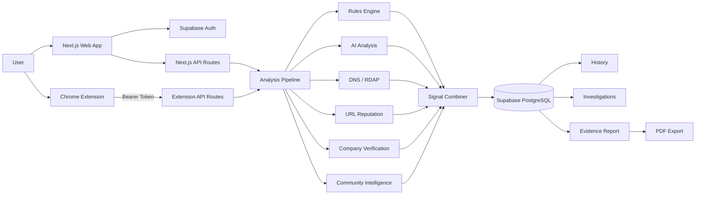
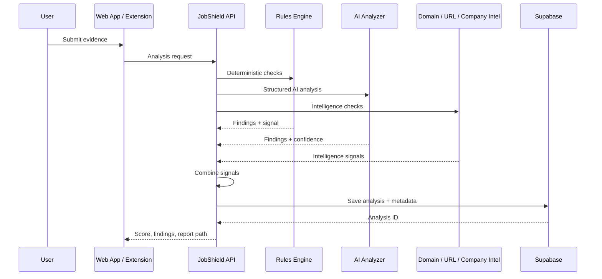
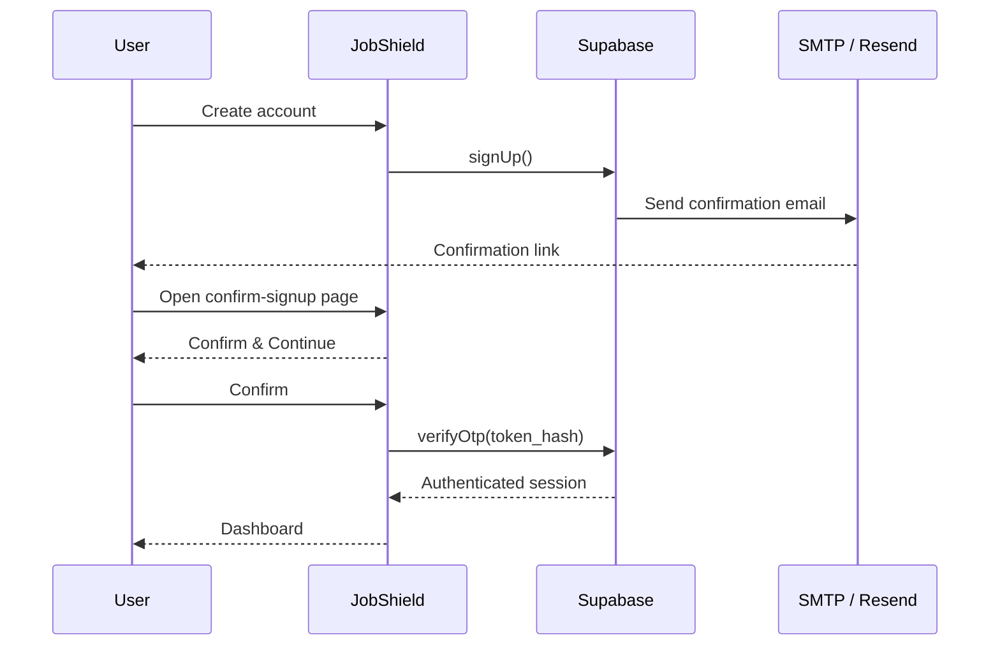
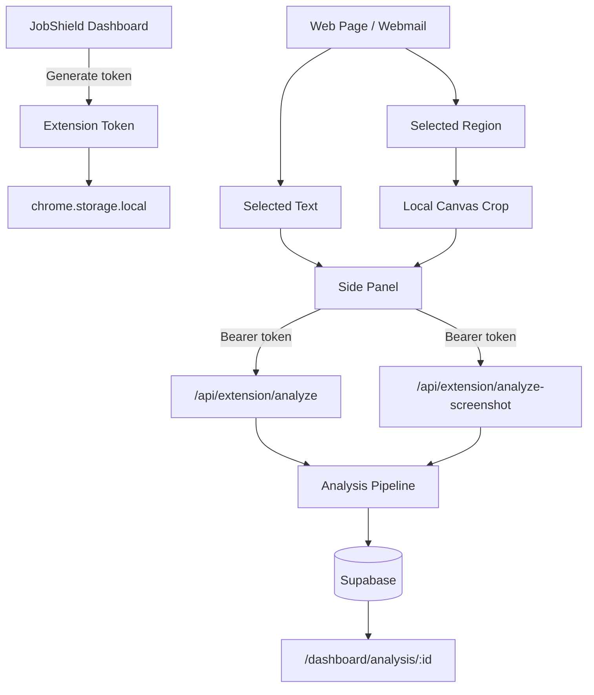

# JobShield

> Evidence-driven job scam detection for recruiter messages, emails, job postings, documents, screenshots, websites, and browser content.

**Live app:** https://jobshield-three.vercel.app

JobShield is a full-stack SaaS security application that helps users investigate suspicious employment opportunities before they send money, share sensitive information, purchase equipment, or continue with a potentially fraudulent recruiter.

Unlike a single-model classifier, JobShield combines deterministic rules, structured AI analysis, domain intelligence, URL reputation, company verification, community intelligence, file extraction, and browser-based evidence capture. Results are stored in each authenticated user's private workspace and can be reviewed, organized into investigations, shared, and exported as evidence reports.

---

## Features

- Analyze recruiter messages, emails, job postings, screenshots, job-offer documents, email files, browser-selected text, and browser-selected screenshot regions.
- Hybrid detection using deterministic rules plus AI-assisted analysis.
- DNS/RDAP domain intelligence and local URL-reputation checks.
- Company-verification and community-intelligence signals.
- Risk score, risk level, summary, findings, and source-level signal breakdowns.
- Searchable analysis history with editable analysis titles.
- Investigation/case management for grouping related evidence.
- Private evidence reports with PDF export and share-link support.
- Chrome Manifest V3 extension for selected-text and selected-region screenshot analysis.
- Privacy-focused screenshot workflow: crop locally, upload only the selected region, do not retain raw screenshots.
- Supabase authentication with signup confirmation, login/logout, forgot-password, recovery, and password-update flows.
- Revocable browser-extension bearer tokens that are separate from the user's web login session.
- Production deployment on Vercel.

---

## What JobShield Can Analyze

### Recruiter messages

A message such as:

> Dear Applicant, your resume has been reviewed and shortlisted. This position is fully remote. Kindly respond as soon as possible.

can produce findings for issues such as generic applicant addressing, vague recruiter identity, unusual urgency, missing screening details, or an unverifiable hiring process.

JobShield distinguishes these weaker warning signs from stronger indicators such as payment requests, fake-check language, sensitive-data requests, equipment-purchase requests, suspicious URLs, or cryptocurrency/gift-card instructions.

### Job postings

JobShield can evaluate compensation claims, hiring-process language, suspicious contact instructions, embedded domains, company identity, and other job-posting signals.

### Job-offer documents

Uploaded offer documents are extracted and analyzed through the same shared risk pipeline used for text submissions.

### Email files

Uploaded email content can be analyzed together with email-specific signals and metadata.

### Browser-selected text

The JobShield Chrome extension lets a user highlight suspicious content directly on a webpage or webmail client and send only that selection for analysis.

### Browser-selected screenshot regions

The extension also supports rectangular screenshot selection. The visible tab is captured temporarily in extension memory, cropped locally, previewed, and only the selected PNG region is uploaded.

---

# Architecture



## Architectural principles

**Defense in depth.** No single signal decides the result. Deterministic rules, AI, domain intelligence, URL intelligence, company checks, and community data contribute independently.

**Explainability.** JobShield stores findings and signal breakdowns so users can see why a score was produced.

**Graceful degradation.** AI, DNS, RDAP, or threat-intelligence failures should not make the entire analysis unusable when other signals can still run.

**User isolation.** Analyses, cases, reports, and extension tokens are associated with authenticated users and protected with Supabase authorization and Row Level Security.

**Privacy by design.** Browser screenshots upload only the user-selected crop. The full viewport is not uploaded and raw screenshot images are not retained in the analysis record.

**Separate extension authentication.** The browser extension uses a revocable bearer token instead of sharing the user's web-session cookies.

---

# Analysis Pipeline



Different input types are normalized before entering the shared pipeline. Text can be analyzed directly, while screenshots, job-offer documents, and email files first require extraction or parsing.

## Deterministic rules

The rules layer detects known scam patterns without relying on AI. Examples include:

- Upfront-payment requests
- Equipment-purchase schemes
- Gift-card or cryptocurrency requests
- Sensitive identity or banking-data requests
- Fake-check language
- Excessive urgency
- Generic recruiter language
- Suspicious contact patterns
- Suspicious links and domains

## AI-assisted analysis

The AI layer evaluates contextual issues that simple matching cannot capture well, including inconsistent hiring processes, pressure tactics, unsupported recruiter claims, and vague role descriptions.

AI is treated as one signal source. It does not directly dictate the final JobShield risk score.

## Domain, URL, and company intelligence

When relevant entities are detected, JobShield can perform DNS/RDAP checks, URL-reputation checks, and company/domain corroboration. A valid domain or company match is supporting evidence only and is never treated as proof that an opportunity is legitimate.

---

# Risk Scoring

JobShield combines independent source signals with a probability-style accumulation model:

```text
combinedRisk = 1 - Π(1 - sourceSignal)
```

Each source is bounded by its own maximum contribution before combination.

This allows one strong signal to matter, multiple moderate signals to accumulate, and AI to remain only one contributor to the final 0-100 score.

The score is a risk indicator, not a factual determination that an employer, recruiter, or opportunity is fraudulent.

---

# Authentication

JobShield uses Supabase Auth with server-side protection for authenticated pages.

Supported flows include signup, email confirmation, login, logout, forgot password, recovery, and password updates.

## Signup confirmation flow



## Password recovery flow

```text
Forgot Password
    ↓
Reset email
    ↓
/auth/recovery?token_hash=...
    ↓
verifyOtp(type: "recovery")
    ↓
Authenticated recovery session
    ↓
/auth/update-password
    ↓
updateUser({ password })
    ↓
Dashboard
```

---

# Browser Extension

The Chrome Manifest V3 extension contains a side panel, service worker, context-menu integration, local storage, injected area-selection logic, and bearer-token authentication.



The extension token and web login session are intentionally separate. Extension tokens can be revoked without logging the user out of the website.

Production extension traffic uses:

```text
https://jobshield-three.vercel.app
```

Using Vercel deployment-specific preview hostnames and the canonical production hostname interchangeably can create separate browser-session cookies because they are different origins.

---

# Screenshot Privacy

The browser screenshot workflow follows a least-privilege model:

```text
Select area
→ temporary visible-tab capture
→ local crop
→ preview selected crop
→ upload cropped PNG only
→ extract/analyze
→ store provenance metadata
→ do not retain raw screenshot image
```

Browser-capture metadata can include the source website, capture type, selected-region dimensions, extraction confidence, warnings, and privacy flags indicating that the full viewport was not uploaded.

---

# Evidence Reports

Every completed analysis can produce a detailed evidence report containing the analysis title, score, risk level, summary, findings, signal breakdown, domain intelligence, URL reputation, company-verification data, relevant extraction metadata, browser-capture provenance, and analyzed content.

Reports can be exported to PDF using `pdf-lib`.

The PDF export is useful for saving evidence, sharing findings, attaching documentation to a fraud report, or preserving an investigation outside the application.

---

# Case Management

JobShield includes investigation management for grouping related analyses.

Users can create cases, add existing evidence, review an investigation timeline, open individual evidence reports, remove evidence, close investigations, and delete closed cases.

Deleting a case removes the case relationships without deleting the original analysis history.

---

# Community Intelligence

Users can submit scam reports that contribute supporting intelligence around repeated recruiter, company, domain, URL, contact, or scam-pattern observations.

Community information supplements the primary analysis pipeline and is not treated as authoritative proof by itself.

---

# Technology Stack

| Layer | Technology |
|---|---|
| Framework | Next.js 16 App Router |
| Language | TypeScript |
| Frontend | React + Tailwind CSS |
| Authentication | Supabase Auth |
| Database | Supabase PostgreSQL |
| Authorization | Supabase Row Level Security |
| AI | OpenAI API with structured analysis |
| Domain Intelligence | DNS + RDAP |
| URL Intelligence | Local threat/reputation checks |
| PDF Generation | `pdf-lib` |
| Browser Extension | Chrome Manifest V3 |
| Transactional Email | Supabase Auth + custom SMTP / Resend |
| Hosting | Vercel |
| Icons | Lucide |

---

# Project Structure

```text
jobshield/
├── app/
│   ├── api/
│   │   ├── analyze/
│   │   ├── extension/
│   │   │   ├── analyze/
│   │   │   ├── analyze-screenshot/
│   │   │   └── tokens/
│   │   ├── reports/
│   │   ├── cases/
│   │   └── community-reports/
│   ├── auth/
│   │   ├── login/
│   │   ├── sign-up/
│   │   ├── sign-up-success/
│   │   ├── confirm-signup/
│   │   ├── forgot-password/
│   │   ├── recovery/
│   │   └── update-password/
│   ├── dashboard/
│   │   ├── analysis/
│   │   └── history/
│   └── share/
├── components/
│   ├── analysis/
│   └── ui/
├── extension/
│   ├── manifest.json
│   ├── sidepanel.html
│   ├── sidepanel.css
│   ├── sidepanel.js
│   ├── service-worker.js
│   └── area-selector.js
├── lib/
│   ├── analysis/
│   ├── extension/
│   ├── reports/
│   └── supabase/
├── scripts/
└── proxy.ts
```

---

# Local Development

Install dependencies:

```bash
npm install
```

Create `.env.local` using the environment-variable names expected by your current deployment. Typical configuration includes Supabase client credentials plus server-only credentials for the analysis pipeline.

Example shape:

```bash
NEXT_PUBLIC_SUPABASE_URL=
NEXT_PUBLIC_SUPABASE_PUBLISHABLE_KEY=

OPENAI_API_KEY=

# If used by the current server-side implementation:
SUPABASE_SERVICE_ROLE_KEY=
```

Never expose private server credentials through a `NEXT_PUBLIC_` variable.

Start development:

```bash
npm run dev
```

Then open:

```text
http://localhost:3000
```

Run a production build with:

```bash
npm run build
```

---

# Browser Extension Development

Load the extension as an unpacked extension from the `extension/` directory using `chrome://extensions`.

For local development, the extension can connect to:

```text
http://localhost:3000
```

For production:

```text
https://jobshield-three.vercel.app
```

The appropriate JobShield origin must be present in `host_permissions` so extension pages can make cross-origin API requests.

---

# Deployment

JobShield is deployed on Vercel:

**https://jobshield-three.vercel.app**

Vercel must be configured with the same required environment variables used locally.

Supabase Auth must allow the canonical production callbacks, including:

```text
https://jobshield-three.vercel.app/auth/confirm-signup
https://jobshield-three.vercel.app/auth/recovery
https://jobshield-three.vercel.app/auth/update-password
```

Use the canonical production hostname consistently for web login, signup, recovery, browser-extension configuration, and evidence-report links.

---

# Security and Privacy

- Supabase Row Level Security isolates user-owned data.
- Browser-extension API access uses revocable bearer tokens instead of web-session cookies.
- User-submitted recruiter messages, emails, files, and webpage content are treated as untrusted input.
- Browser screenshot cropping happens locally.
- Only the selected screenshot region is uploaded.
- Full viewport screenshots are not uploaded by the selected-region workflow.
- Raw screenshot images are not retained in the analysis database.
- Server-side secrets must never be committed to Git or exposed through public environment variables.
- `.env.local`, OpenAI keys, Supabase service-role keys, SMTP credentials, Resend API keys, and extension bearer tokens must remain private.

---

# Email Configuration

JobShield uses Supabase Auth with custom SMTP through Resend.

For a public production email setup, use a verified sending domain and a sender such as:

```text
no-reply@your-domain.com
```

The existing confirmation and recovery architecture does not need to change when the SMTP sender is upgraded.

---

# Important Notice

JobShield provides risk indicators and corroborating evidence. It does not guarantee that a recruiter, company, website, message, or job opportunity is legitimate or fraudulent.

A low score, valid domain, company match, or absence of detected warning signs is not proof of legitimacy.

Users should independently verify important employment communications before sending money, identity documents, credentials, tax information, or sensitive financial information.

